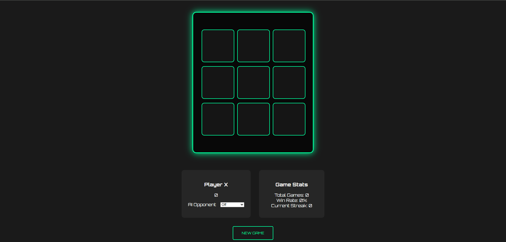

# Tic-Tac-Toe

# CyberTac - Advanced Tic-Tac-Toe 🎮

CyberTac is a modern, cyberpunk-themed Tic-Tac-Toe game with advanced features like AI opponents, real-time statistics, and stunning visual effects. Built with HTML, CSS, and JavaScript, this project combines classic gameplay with a futuristic design.

 <!-- Add a screenshot if available -->

---

## Features ✨

- **Cyberpunk Design**: Neon glow effects, scanline animations, and futuristic typography.
- **AI Opponent**: Play against an AI with three difficulty levels:
  - **Easy**: Random moves.
  - **Medium**: Strategic moves with some randomness.
  - **Unbeatable**: Perfect play using the Minimax algorithm.
- **Real-Time Stats**: Track wins, losses, draws, win rate, and current streaks.
- **Interactive UI**: Hover effects, animated winning cells, and smooth transitions.
- **Responsive Design**: Works on both desktop and mobile devices.

---

## How to Play 🕹️

1. **Start the Game**:
   - Open the `index.html` file in your browser.
   - The game starts with Player X's turn.

2. **Make a Move**:
   - Click any empty cell to place your mark (X or O).
   - The AI will automatically make its move if enabled.

3. **Win the Game**:
   - Get three of your marks in a row (horizontally, vertically, or diagonally).
   - Winning cells will glow with a neon effect.

4. **Reset the Game**:
   - Click the "New Game" button to reset the board and start over.

5. **Toggle AI Difficulty**:
   - Use the dropdown menu to switch between:
     - **Off**: Play against a friend.
     - **Easy**, **Medium**, or **Unbeatable**: Play against the AI.

---

## Installation 🛠️

1. **Clone the Repository**:
   ```bash
   git clone https://github.com/hasanulhossaint/Tic-Tac-Toe.git
